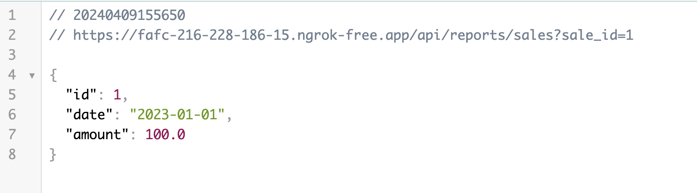
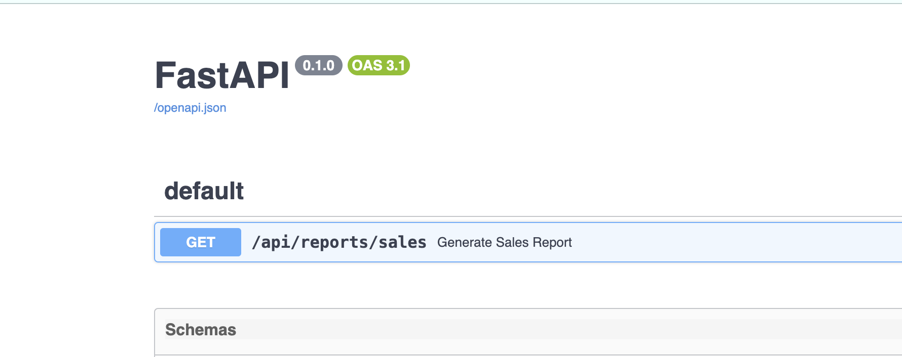
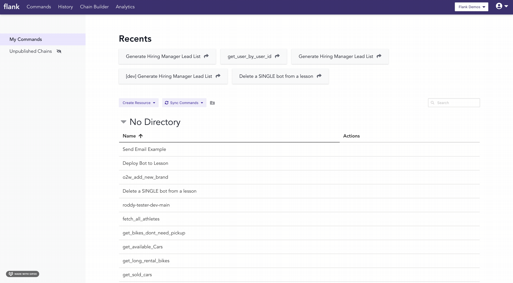

# Quick Start

## Get started with Flank in 5-10 minutes.
This tutorial uses a Jupyter Notebook and FastAPI to quickly set up a Python API that can be run and shared on Flank. For instructions on setting up a Jupyter notebook, [read here](https://jupyter.org/install).

### 1. Install FastAPI, ngrok, and uvicorn

In your Jupyter notebook, install the following libraries:

- **fastapi** for setting up your API framework
- **uvicorn** for running your API
- **ngrok** for exposing it to Flank

```
%pip install -q fastapi pyngrok uvicorn
```

We'll also want to import `nest_asyncio` for running FastAPI within a notebook.

```
import nest_asyncio
import uvicorn
from fastapi import FastAPI, Query
from pyngrok import ngrok
```

### 2. Set up your API

Next, set up your FastAPI endpoints. You can set up as many as you'd like, to do whatever you'd like, but here we'll set up an endpoint to generate a simple sales report.
```
sales_data = [
    {"id": 1, "date": "2023-01-01", "amount": 100.0},
    {"id": 2, "date": "2023-01-02", "amount": 150.0},
    {"id": 3, "date": "2023-01-03", "amount": 200.0},
    {"id": 4, "date": "2023-01-04", "amount": 120.0},
    {"id": 5, "date": "2023-01-05", "amount": 180.0},
]

@app.get("/api/reports/sales")
async def generate_sales_report(
    sale_id: int = Query(..., description="Sale ID to filter the sales report")
) -> dict:
    for sale in sales_data:
        if sale["id"] == sale_id:
            return sale
    return {"error": "Sale not found"}
```
### 3. Run your API, and expose it on the web
We'll use `ngrok` to expose our API, and run it with `nest_asyncio` and `uvicorn`. You can choose any port on your localhost that's open. Here we'll run and expose the API on port 8010.
```
ngrok_tunnel = ngrok.connect(8010)
print('Public URL:', ngrok_tunnel.public_url)
nest_asyncio.apply()
uvicorn.run(app, port=8010)
```
Grab the output of this line: `print('Public URL:', ngrok_tunnel.public_url)`. Your ngrok url should be something like `https://fafc-216-228-186-15.ngrok-free.app/`.

Verify that your endpoint is up and running by going to it in your browser:



Since we're using FastAPI, we automatically have an OpenAPI spec generated for us at `your-ngrok-endpoint/openapi.json`.
Verify you can see your docs by going to your ngrok `docs` endpoint:



### 4. Add your API to Flank
Navigate to [flank.cloud](flank.cloud) and log in.

Go to **Create Resource** and choose **API**. Choose **Add your own API**. Paste in docs endpoint for the **API Specs URL**, and nickname the API whatever you'd like.



Remember, your docs endpoint should be something like `https://fafc-216-228-186-15.ngrok-free.app/openapi.json`.

### 5. Sync your endpoint
Now, you can sync your endpoint. Syncing just means Flank automatically finding 

### 6. Run it, share it, Flank it

Run into problems? Email us at [mallory@flank.cloud](mailto:mallory@flank.cloud).
