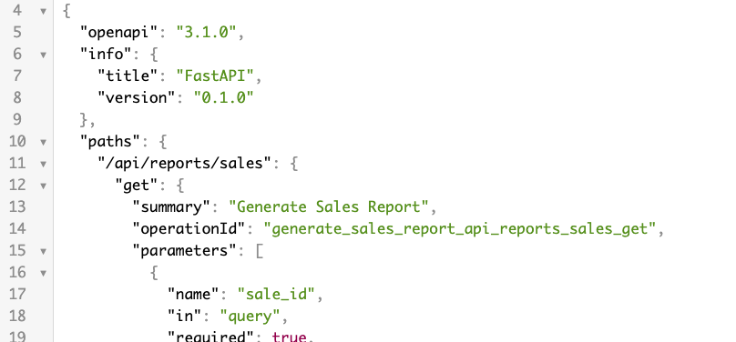

# Quick Start
## Get started with Flank in 5 minutes.

In this example, we're going to create an API on your computer, serve it over the internet, and Flank will create a webpage for interacting with it. It should take less than 5 minutes.

The quickstart is contained in a Jupyter notebook. You can choose to run your notebook in Google Colab (if you have a Google account), or with your command line and the Jupyter browser. 

=== "Google Colab"

    ### 1. Download the notebook [here](https://flank-quickstart-public.s3.us-west-2.amazonaws.com/flank-quickstart.ipynb).

    ### 2. Upload it to Google Colab.

    Go to [Google Colab](https://colab.research.google.com/){:target="_blank"} and upload the notebook. 

    

    ### 3. Get rolling on Flank.

    The instructions are all contained in the notebook. You'll progress through it by hitting Shift + Enter to run the different steps. 5 minutes to Flank!


=== "Command line + Jupyter"

        
    ### Prerequisites
    - Python installed on your computer
    - A ngrok account. If you don't have an ngrok account, [you can sign up here](https://dashboard.ngrok.com/get-started/your-authtoken).
    - We'll walk through the basic Jupyter setup but for more information on setting up and running notebooks, [read here](https://jupyter.org/install).

    ### 1. Download the notebook.

    We'll be using [this notebook](https://flank-quickstart-public.s3.us-west-2.amazonaws.com/flank-quickstart.ipynb) for our quickstart. You can download it [here](https://flank-quickstart-public.s3.us-west-2.amazonaws.com/flank-quickstart.ipynb).

    ### 2. Setup your venv and Jupyter

    Open up your terminal and run the following to set up a python virtual env.

    ```
    python -m venv flankvenv

    . flankvenv/bin/activate
    ```

    Now that your venv is activated, install and run jupyter notebook.

    ```
    pip install notebook

    jupyter notebook
    ```

    This will open up a browser window with Jupyter running.

    Open up the Flank notebook you downloaded earlier.

    

    ### 3. Running your notebook: install required libraries
    Now that we've got your notebook open, we'll start walking through and running the notebook. 

    First, install the following libraries:

    - **fastapi** for setting up your API framework
    - **uvicorn** for running your API
    - **ngrok** for exposing it to Flank

    ```
    %pip install -q fastapi pyngrok uvicorn
    ```

    We'll also want to import `nest_asyncio` for running FastAPI within a notebook.

    ```
    import nest_asyncio
    import uvicorn
    from fastapi import FastAPI, Query
    from pyngrok import ngrok, conf
    ```

    ### 4. Set up your API

    Next, set up your FastAPI endpoints. You can set up as many as you'd like, to do whatever you'd like, but here we'll set up an endpoint to generate a simple sales report.
    ```
    app = FastAPI()

    sales_data = [
        {"id": 1, "date": "2023-01-01", "amount": 100.0},
        {"id": 2, "date": "2023-01-02", "amount": 150.0},
        {"id": 3, "date": "2023-01-03", "amount": 200.0},
        {"id": 4, "date": "2023-01-04", "amount": 120.0},
        {"id": 5, "date": "2023-01-05", "amount": 180.0},
    ]

    @app.get("/api/reports/sales")
    async def generate_sales_report(
        sale_id: int = Query(..., description="Sale ID to filter the sales report")
    ) -> dict:
        for sale in sales_data:
            if sale["id"] == sale_id:
                return sale
        return {"error": "Sale not found"}
    ```
    ### 5. Run your API, and expose it on the web
    We'll use `ngrok` to expose our API, and run it with `nest_asyncio` and `uvicorn`. 
    
    First, copy and enter your ngrok api key, which can be found at [https://dashboard.ngrok.com/get-started/your-authtoken](https://dashboard.ngrok.com/get-started/your-authtoken).

    ```
    print("Enter your authtoken, which can be copied from https://dashboard.ngrok.com/get-started/your-authtoken")
    conf.get_default().auth_token = getpass.getpass()
    ```

    Now we'll expose your endpoint to the web. You can choose any port on your localhost that's open. Here we'll run and expose the API on port 8010.
    ```
    ngrok_tunnel = ngrok.connect(8010)
    print('Public URL:', ngrok_tunnel.public_url)
    nest_asyncio.apply()
    uvicorn.run(app, port=8010)
    ```
    Grab the output of this line: `print('Public URL:', ngrok_tunnel.public_url)`. Your ngrok url should be something like `https://fafc-216-228-186-15.ngrok-free.app/`.

    Verify that your endpoint is up and running by going to it in your browser at `https://fafc-216-228-186-15.ngrok-free.app/api/reports/sales?sale_id=1` (with your ngrok url in place).

    

    Since we're using FastAPI, we automatically have an OpenAPI spec generated for us at `your-ngrok-endpoint/openapi.json`.
    Verify you can see your docs by going to your ngrok `docs` endpoint:

    

    ### 6. Add your API to Flank
    Navigate to [flank.cloud](flank.cloud) and log in.

    Go to **Create Resource** and choose **API**. Choose **Add your own API**. Paste in docs endpoint for the **API Specs URL**, and nickname the API whatever you'd like.

    

    Remember, your docs endpoint should be something like `https://fafc-216-228-186-15.ngrok-free.app/openapi.json`.

    ### 7. Sync your endpoint
    Next, sync your endpoint. Syncing just means Flank automatically finds the endpoints in your API. You can pick and choose the ones you'd like to add.

    

    ### 8. Run it, share it, Flank it
    Now, you've got a dedicated page webpage on which you can run your endpoint (we call these endpoints "commands" in Flank).

    Notice that Flank automatically found the parameters of your sales report endpoint. Flank will find parameters specified in API specs. 

    TODO - If you want to further configure the command, 
    TODO - Running
    TODO - Sharing
    TODO - Note about exposing beyond ngrok, adding more endpoints


    And share your endpoint...

Run into problems? Email us at [mallory@flank.cloud](mailto:mallory@flank.cloud).
